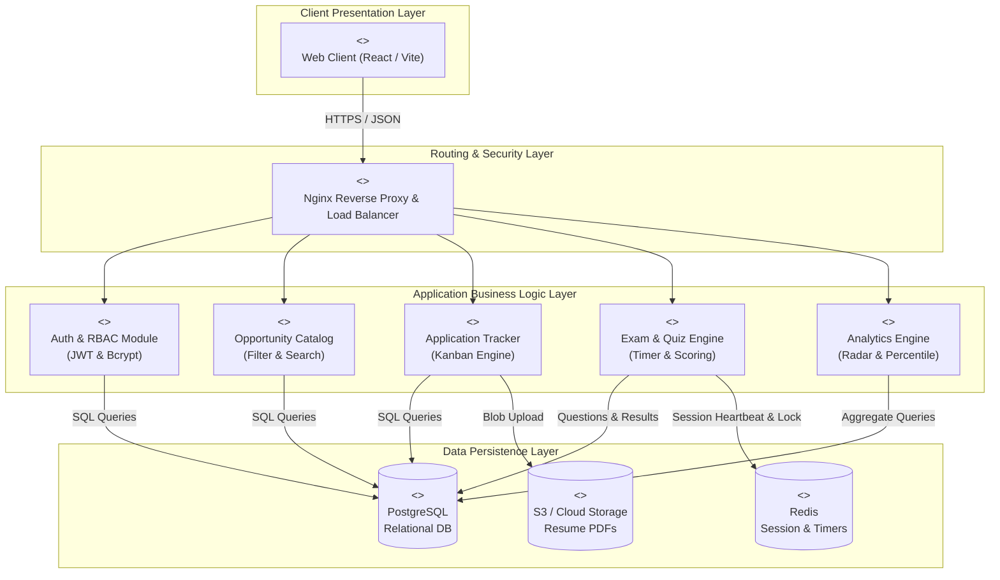
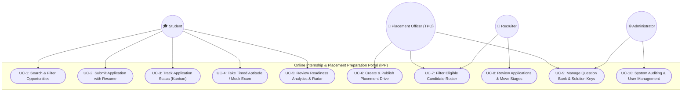
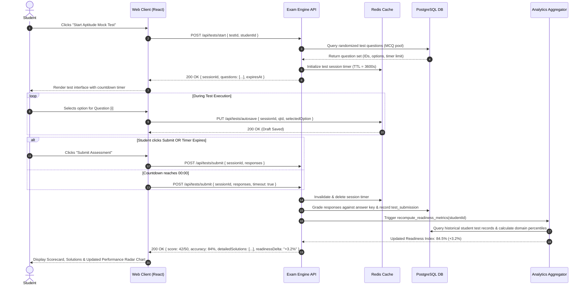

# 4. System Design & UML Architecture

[-0052CC.svg)](https://pes.edu)

**Project**: Online Internship & Placement Preparation Portal (IPP)  
**Institution**: PES University | Department of Computer Science & Engineering  
**Student SRN**: PES1UG24CS453  

---

## 🏛️ 1. Architectural Pattern Recognition & Selection

### Evaluated Patterns Comparison
| Architectural Pattern | Advantages for IPP | Limitations / Trade-offs | Verdict & Justification |
|:---|:---|:---|:---:|
| **Traditional Monolith** | Simple to build and deploy locally | Tight coupling; a spike in exam submissions can degrade the job search board | ❌ Rejected for lack of fault isolation |
| **Pure Microservices** | High modularity; independent deployment | Excessive overhead for orchestration, inter-service network latency | ❌ Over-engineered for project scope |
| **Layered Client-Server (3-Tier) with Modular Services** | Strict separation of concerns (UI, Business Logic, Data); independent scaling of exam evaluation engine; rapid development | Requires careful API contract governance | ✅ **Selected Architecture** |

### Selected Architecture Justification
The **3-Tier Layered Architecture** with decoupled modular REST services is chosen because:
1. **Presentation Tier**: Provides a high-performance Single Page Application (SPA) responsive across desktop and mobile devices.
2. **Application Tier**: Encapsulates business rules into distinct functional controllers (`Auth`, `Opportunities`, `Tracker`, `ExamEngine`, `Analytics`).
3. **Data Tier**: Combines ACID-compliant relational data storage (`PostgreSQL`) with an in-memory session cache (`Redis`) to guarantee sub-second latency for live test sessions.

---

## 🧩 2. UML Component Architecture Diagram

---

## 👥 3. UML Use Case Diagram

---

## 🔄 4. UML Sequence Diagram: Timed Aptitude Exam & Analytics Sync

---

## 🔌 5. RESTful API Endpoints Specification

| HTTP Method | Endpoint URL | Auth Required | Request Body / Parameters | Response Status & Payload |
|:---:|:---|:---:|:---|:---|
| `POST` | `/api/auth/login` | None | `{ email, password }` | `200 OK` `{ token, user: { id, role, name } }` |
| `POST` | `/api/auth/register` | None | `{ name, email, srn, password, branch, cgpa }` | `201 Created` `{ message, userId }` |
| `GET` | `/api/opportunities` | Student / All | Query: `?branch=CSE&minCgpa=8.0&type=internship` | `200 OK` `[ { driveId, company, role, ctc, deadline } ]` |
| `POST` | `/api/applications/apply` | Student | `{ driveId, resumeUrl }` | `201 Created` `{ applicationId, status: "Applied" }` |
| `GET` | `/api/applications/my` | Student | Header: `Bearer <token>` | `200 OK` `[ { appId, company, role, stage, updatedAt } ]` |
| `PATCH` | `/api/applications/:id/status`| Recruiter / TPO | `{ stage: "Shortlisted" \| "Interview" \| "Offer" }` | `200 OK` `{ updated: true, newStage }` |
| `GET` | `/api/tests/catalog` | Student | Query: `?category=quant\|logical\|technical` | `200 OK` `[ { testId, title, durationMinutes, totalMarks } ]` |
| `POST` | `/api/tests/start` | Student | `{ testId }` | `200 OK` `{ sessionId, questions, durationSeconds }` |
| `POST` | `/api/tests/submit` | Student | `{ sessionId, answers: [ { qId, selected } ] }` | `200 OK` `{ score, correctCount, analysis }` |
| `GET` | `/api/analytics/readiness` | Student | Header: `Bearer <token>` | `200 OK` `{ readinessScore, radarMetrics, recommendations }` |
| `POST` | `/api/tpo/drives` | TPO / Admin | `{ company, role, eligibility: { cgpa, branches }, deadline }` | `201 Created` `{ driveId, broadcastSent: true }` |
