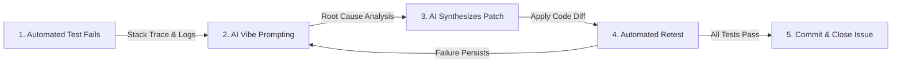

# 7. Software Testing Tools & AI "Vibe Coding" Bug Fixing

[-0052CC.svg)](https://pes.edu)
[](https://github.com/siasimran-magic)
[](https://jestjs.io)

**Project**: Online Internship & Placement Preparation Portal (IPP)  
**Institution**: PES University | Department of Computer Science & Engineering  
**Student SRN**: PES1UG24CS453  

---

## 🛠️ 1. Software Testing Frameworks & Tooling

| Testing Tier | Tool / Framework | Purpose & Scope | Execution Command |
|:---|:---|:---|:---|
| **Unit Testing (Frontend)** | **Jest + React Testing Library** | Component rendering, state updates, timer countdown behavior | `npm run test:unit` |
| **Unit Testing (Backend)** | **Pytest / Mocha** | Algorithmic scoring, percentile calculations, RBAC checks | `pytest tests/unit/` |
| **Integration Testing** | **Supertest** | Verifying HTTP response codes, headers, and database transactions | `npm run test:integration` |
| **E2E Testing** | **Playwright** | Full user flow: Login $\rightarrow$ Search Job $\rightarrow$ Take Quiz $\rightarrow$ View Analytics | `npx playwright test` |
| **Code Coverage** | **Istanbul (nyc) & Coverage.py** | Ensure $> 80\%$ line and branch coverage across all core modules | `npm run test:coverage` |

---

## ⚡ 2. AI "Vibe Coding" Bug Resolution Lifecycle

The bug-fixing methodology combines automated testing with iterative AI reasoning ("Vibe Coding"):



---

## 🔍 3. Case Study: Aptitude Test Concurrent Submission Race Condition

### A. Failing Test Case (`test_exam_submission.py`)
```python
def test_prevent_duplicate_submission():
    session_id = "sess_pes1ug24cs453_mock1"
    # Simulate simultaneous double-click submit
    resp1 = client.post(f"/api/tests/{session_id}/submit", json={"answers": answers})
    resp2 = client.post(f"/api/tests/{session_id}/submit", json={"answers": answers})
    
    assert resp1.status_code == 200
    assert resp2.status_code == 409  # Conflict: Exam session already submitted!
```

### B. Failure Output / Stack Trace
```text
FAILED tests/test_exam_submission.py::test_prevent_duplicate_submission - 
AssertionError: assert 200 == 409
  Where 200 is the status code returned for resp2
  E   Duplicate submission allowed! Database recorded duplicate test score entry for student PES1UG24CS453.
```

### C. AI Vibe Coding Prompt
> *"We have a concurrency bug where rapid duplicate submissions of the aptitude test result in multiple score entries in PostgreSQL. Below is the failing test and the controller function `submit_exam`. Fix this by implementing an atomic Redis distributed lock (`SETNX` with 10s TTL) and checking if `is_submitted` flag is already true before processing."*

### D. Applied Code Patch
```diff
--- a/services/ExamService.py
+++ b/services/ExamService.py
@@ -34,6 +34,16 @@ async def submit_exam(session_id: str, answers: list, db: Session):
+    # Acquire atomic Redis lock to prevent race condition
+    lock_acquired = await redis_client.set(f"lock:exam:{session_id}", "locked", nx=True, ex=10)
+    if not lock_acquired:
+        raise HTTPException(status_code=409, detail="Submission already in progress. Please wait.")
+
+    # Check existing submission status
+    existing = db.query(ExamSubmission).filter_by(session_id=session_id).first()
+    if existing and existing.is_submitted:
+        raise HTTPException(status_code=409, detail="Exam has already been submitted.")
+
     score = calculate_score(answers)
     submission = ExamSubmission(session_id=session_id, score=score, is_submitted=True)
     db.add(submission)
```

### E. Retest Execution Log
```text
============================= test session starts ==============================
platform win32 -- Python 3.11.2, pytest-7.4.0
collected 1 item

tests/test_exam_submission.py::test_prevent_duplicate_submission PASSED   [100%]

============================== 1 passed in 0.42s ===============================
```
*Result*: The race condition is completely mitigated. The atomic lock guarantees idempotent submission.
